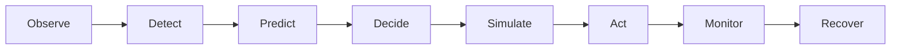
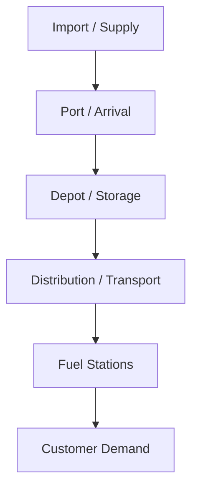

BUP COMPUTER PROGRAMMING CLUB


In association with


## HACKATHON FINALS

# Fuel Supply Intelligence &
# Resilience Platform

Build. Deploy. Observe. Respond.

**THE CHALLENGE**

Build and operate an intelligent decision-support platform for a simulated fuel supply network in Bangladesh. Your system should help an operations team understand fuel availability, identify emerging shortages, respond to disruptions, recommend allocation decisions, and remain usable when parts of the system fail.

**This is not only a machine-learning challenge.**

<table>
    <thead>
        <tr>
            <th>Application Development</th>
            <th>AI / Decision Intelligence</th>
            <th>DevOps &#x26; Reliability</th>
        </tr>
    </thead>
    <tbody>
        <tr>
            <td>Build the operator experience</td>
            <td>Predict, detect, optimize</td>
            <td>Ship, observe, recover</td>
        </tr>
    </tbody>
</table>


 **BUP CSE FEST 2026 | HACKATHON FINALS**

## Challenge at a Glance

<table>
        <tr>
            <td>Core goal</td>
            <td>Build a working fuel operations decision-support platform<br />on top of the organizer-provided simulator.</td>
        </tr>
        <tr>
            <td>Must include</td>
            <td>Operator-facing application, backend, intelligence<br />component, deployment, observability, resilience, and load<br />testing.</td>
        </tr>
        <tr>
            <td>Intelligence</td>
            <td>At least one meaningful AI / ML / optimization / detection<br />capability. Reinforcement learning is optional.</td>
        </tr>
        <tr>
            <td>Environment</td>
            <td>All teams integrate with the same BUP Fuel Supply<br />Simulator.</td>
        </tr>
        <tr>
            <td>Hackathon dynamic</td>
            <td>Organizers may introduce surprise domain and engineering<br />events during development or judging.</td>
        </tr>
        <tr>
            <td>Deployment</td>
            <td>The system must be reproducibly runnable, preferably<br />containerized.</td>
        </tr>
        <tr>
            <td>Judging focus</td>
            <td>Working product, decision usefulness, architecture,<br />DevOps, resilience, observability, and live demonstration.</td>
        </tr>
</table>

## 1. Executive Summary

Bangladesh's simulated fuel supply network consists of interconnected supply points, depots, transportation routes, regions, fuel stations, and customer demand. A disruption at one stage can affect the rest of the network. A delayed shipment may reduce depot inventory. A demand spike can create regional shortages. A route failure can make an otherwise valid allocation impossible.

Your challenge is to build an intelligent Fuel Supply Operations Platform capable of:

* observing the current simulated fuel network;
* identifying emerging shortages and operational risks;
* helping operators decide how constrained fuel should be allocated;
* responding to unexpected disruptions;
* exposing the reasoning behind important recommendations;
* remaining observable and usable during application or service failures;
* demonstrating measurable system performance under load.

The platform must operate entirely against the BUP Fuel Supply Simulator provided by the organizers. No real fuel infrastructure will be accessed or controlled.

Page 2


BUP CSE FEST 2028 | HACKATHON FINALS

## 2. Primary Engineering Challenge

### PRIMARY ENGINEERING QUESTION
Can your team build, deploy, and operate an intelligent system that helps a fuel operations center respond to changing demand, constrained supply, operational disruptions, and software failures?

Your solution should demonstrate the complete engineering loop:



The emphasis is not on achieving the highest ML accuracy alone. Judges should be able to interact with and observe a working system.

## 3. Scenario

The system represents a simulated fuel supply chain:



The primary fuel categories are Diesel, Petrol, and Octane. Teams may model additional operational concepts when useful.

## 4. Organizer-Provided Fuel Supply Simulator

All teams will receive access to the same BUP Fuel Supply Simulator. The simulator acts as the simulated operational environment for the hackathon.

It will provide information such as:
* depots and stations;
* inventory by fuel type;
* regional demand;
* incoming supply;
* transport routes and travel constraints;
* supply delays;
* operational events and crisis conditions.

Teams will interact with the simulator through documented APIs. Example conceptual endpoints may include:


Page 3

 BUP CSE FEST 2026 | HACKATHON FINALS

```text
GET /stations
GET /depots
GET /supply-arrivals
GET /demand-history
GET /routes
GET /events

POST /allocations
```

### IMPORTANT
Teams are not required to build their own fuel-supply simulator. The organizers provide the operational world. Your job is to build the intelligent system that operates on top of it.

## 5. What Your Team Must Build
Each team must build a complete end-to-end platform for fuel supply intelligence and resilience. The system should handle data collection and management, perform analysis, support decision-making, provide applications and operator tools, and include monitoring capabilities.

## 6. Application Requirement
Every team must build a usable operator-facing application. A notebook alone is not considered a complete submission.

The application should allow an operator to understand the current state of the fuel network and interact with the team's decision-support system. The application should include a meaningful subset of :

*   current fuel inventory;
*   depot and station status;
*   regional fuel demand;
*   shortage alerts;
*   projected shortage risk;
*   incoming supply;
*   disruptions;
*   recommended allocations;
*   expected impact of decisions;
*   system alerts;
*   decision history;
*   service health.

Teams are free to design the experience. A web application is recommended, but other interfaces may be accepted if they meaningfully support the operations workflow.

## 7. Intelligence Requirement
Every team must implement at least one meaningful intelligent capability. Teams may choose the techniques that best fit their architecture.

### Prediction
*   demand forecasting
*   shortage prediction
*   stockout probability
*   estimated supply arrival
*   transport delay prediction

Page 4


 **BUP CSE FEST 2026 | HACKATHON FINALS**

## Detection

* anomalous demand
* abnormal inventory changes
* supply-chain bottlenecks
* emerging regional disruptions

## Decision Intelligence

* constrained optimization
* heuristic allocation
* priority-based allocation
* reinforcement learning
* mathematical optimization
* hybrid policies

## Generative AI

* incident explanation
* supply-chain state summarization
* operator investigation assistance
* human-readable decision explanations

LLMs should support the operational system rather than merely provide a chatbot around the application.

# 8. Reinforcement Learning

> **OPTIONAL**
> Reinforcement learning is optional. Teams that believe RL is appropriate may use it for allocation or sequential decision-making.

A possible RL formulation could include:

**State**
inventory, demand, predicted shortage, available supply, route availability

**Action**
allocate quantity, select destination, select route, delay allocation

**Reward**
reduce unmet demand, reduce transport cost, reduce stockouts, maintain service level

If RL is used, teams should demonstrate why it provides useful behavior compared with a reasonable rule-based or heuristic approach.

Page 5


BUP CSE FEST 2026 | HACKATHON FINALS

## 9. Decision Support

Important recommendations should be inspectable. For example:

# ALERT

**Station:** DHAKA-021
**Fuel:** Diesel

**Projected Stockout:** 6.2 hours
**Current Inventory:** 8,400 L
**Expected Demand:** 11,900 L

**Recommended Allocation:**
5,000 L from DEPOT-03

**Expected Result:**
Stockout risk reduced 72% → 19%

Where appropriate, teams should show why an area is considered at risk, which signals influenced the recommendation, relevant constraints, expected impact, confidence or uncertainty, and alternative actions. Human operators should remain able to inspect important decisions.

## 10. Crisis and Event Handling

During the hackathon, organizers may introduce changes to the simulated environment. Examples include:

<table>
    <thead>
        <tr>
            <th>Scenario</th>
            <th>Example Condition</th>
            <th>What Your System Should Show</th>
        </tr>
    </thead>
    <tbody>
        <tr>
            <td>Shipment delay</td>
            <td>Incoming fuel arrives later than<br />expected.</td>
            <td>Warning, shortage impact, decision<br />response, recovery.</td>
        </tr>
        <tr>
            <td>Demand spike</td>
            <td>One or more regions experience<br />elevated demand.</td>
            <td>Risk change, forecast/detection<br />response, allocation adaptation.</td>
        </tr>
        <tr>
            <td>Depot constraint</td>
            <td>Available inventory or capacity is<br />reduced.</td>
            <td>Constraint handling, reallocation, service<br />impact.</td>
        </tr>
        <tr>
            <td>Regional disruption</td>
            <td>A route or region becomes temporarily<br />unavailable.</td>
            <td>Alternative allocation and recovery<br />behavior.</td>
        </tr>
        <tr>
            <td>Combined crisis</td>
            <td>Two or more disruptions occur together.</td>
            <td>End-to-end resilience and failure<br />boundaries.</td>
        </tr>
    </tbody>
</table>

Teams should demonstrate how their system detects, evaluates, responds, explains, and monitors recovery.

## 11. Application Resilience

Teams must define what happens when something goes wrong.

```text
ML model unavailable          → Fallback allocation policy
Invalid simulator response    → Reject input + raise alert
Prediction confidence too low → Human review requested
Backend dependency unavailable → Retry / cached state / degraded mode
```


Page 6


**BUP CSE FEST 2026 | HACKATHON FINALS**

Teams are encouraged to implement appropriate mechanisms such as fallback logic, graceful degradation, retries, timeout handling, health checks, cached state, validation, circuit breakers, and rollback. Sophisticated fault-tolerance infrastructure is not mandatory; clear and demonstrable behavior is more important.

## 12. DevOps Requirement

Every system must be deployable. At minimum, teams should provide a reproducible way to launch the application, for example:

```text
docker compose up
```

or an equivalent documented deployment process.

Teams should demonstrate a basic software delivery workflow.

**Source Code → Build → Test → Package → Deploy → Health Check → Running Application**

A CI/CD workflow is strongly encouraged. Examples include GitHub Actions, GitLab CI, Jenkins, or equivalent automation.

## 13. Advanced DevOps Opportunities

Teams seeking additional technical depth may implement:

* Kubernetes;
* Helm;
* Infrastructure as Code;
* Terraform;
* GitOps;
* automated rollback;
* blue/green deployment;
* canary deployment;
* autoscaling;
* distributed services;
* service discovery;
* queue-based processing.

These are optional. Do not introduce infrastructure complexity unless it improves your solution.

## 14. Observability Requirement

Your team must be able to understand what the system is doing. Teams must implement meaningful observability covering the application.

<table>
    <thead>
        <tr>
            <th>Layer</th>
            <th>Examples</th>
        </tr>
    </thead>
    <tbody>
        <tr>
            <td>Application</td>
            <td>request rate, latency, error rate, service availability</td>
        </tr>
        <tr>
            <td>System</td>
            <td>CPU, memory, resource utilization</td>
        </tr>
        <tr>
            <td>Intelligence</td>
            <td>prediction error, model confidence, shortage-alert rate,<br />decision frequency, fallback activation</td>
        </tr>
        <tr>
            <td>Logs</td>
            <td>important actions, integration failures, decision events,<br />recoveries</td>
        </tr>
    </tbody>
</table>

Page 7


BUP CSE FEST 2026 | HACKATHON FINALS

Distributed tracing is optional. Suggested tools may include Prometheus, Grafana, OpenTelemetry, Loki, ELK, Jaeger, or equivalent tools. Teams are free to choose their stack.

## 15. Health and Status

The application should expose the health of important components where meaningful. Example:

**SYSTEM STATUS**

<table>
    <thead>
        <tr>
            <th colspan="2">SYSTEM STATUS</th>
        </tr>
    </thead>
    <tbody>
        <tr>
            <td>Backend API</td>
            <td>Healthy</td>
        </tr>
        <tr>
            <td>Database</td>
            <td>Healthy</td>
        </tr>
        <tr>
            <td>Fuel Simulator</td>
            <td>Healthy</td>
        </tr>
        <tr>
            <td>Prediction Service</td>
            <td>Healthy</td>
        </tr>
        <tr>
            <td>Decision Engine</td>
            <td>Healthy</td>
        </tr>
        <tr>
            <td>p95 Latency</td>
            <td>164 ms</td>
        </tr>
        <tr>
            <td>Error Rate</td>
            <td>0.4%</td>
        </tr>
    </tbody>
</table>

Judges should be able to understand whether the system itself is healthy.

## 16. Data

The primary operational data will come from the organizer-provided simulation environment.

Teams may additionally use public datasets, synthetic data, derived features, generated historical data, or additional contextual information. Any external or generated data should be documented.

> **FOCUS YOUR TIME ON BUILDING**
>
> Teams are not required to create an entire fuel dataset from scratch. The shared simulator is intended to let participants spend hackathon time building and operating solutions rather than manufacturing separate underlying worlds.

## 17. Load Testing

Each team must load-test at least one meaningful application path, such as the prediction API, decision API, simulator integration, dashboard backend, or an end-to-end decision request.

Teams should report relevant measurements such as:

* average latency;
* p50 latency;
* p95 latency;
* p99 latency where available;
* throughput;
* error rate;
* concurrency;
* resource usage.

The emphasis should be on understanding the behavior and limits of the implemented system rather than achieving an arbitrary benchmark.

## 18. Security and Engineering Hygiene

Teams should demonstrate basic software engineering hygiene. At minimum:

* do not hard-code secrets;
* validate external input;
* handle failed requests appropriately;

Page 8


BUP CSE FEST 2026 | HACKATHON FINALS

* document required configuration;
* avoid exposing credentials;
* restrict sensitive operator actions where appropriate.

Teams are not expected to build enterprise-grade security within the hackathon duration.

## 19. Required Deliverables

1. **Working Application:** A runnable end-to-end platform.
2. **Source Repository:** Application code, setup instructions, dependencies, and deployment instructions.
3. **Simulator Integration:** The system must interact with the official BUP Fuel Supply Simulator.
4. **Intelligence Component:** At least one meaningful AI, ML, optimization, detection, or decision-support capability.
5. **Operator Interface:** A usable interface showing meaningful operational information.
6. **Architecture Diagram:** A clear view of simulator $\rightarrow$ data/backend $\rightarrow$ intelligence $\rightarrow$ decision $\rightarrow$ application $\rightarrow$ monitoring.
7. **Deployment:** A reproducible deployment method.
8. **Observability Evidence:** Logs, metrics, dashboards, alerts, or equivalent outputs.
9. **Resilience Demonstration:** Evidence showing how the application responds to at least one meaningful failure condition.
10. **Load-Test Evidence:** Workload definition and measured results.
11. **Final Demo:** A live or judge-supervised demonstration of the system.

## 20. Recommended Deliverables

* CI/CD;
* automated tests;
* experiment tracking;
* model versioning;
* decision audit history;
* deployment versioning;
* simulation replay;
* scenario configuration;
* automated fallback;
* rollback.

## 21. Optional Advanced Work

* reinforcement learning;
* multi-agent decision systems;
* optimization + ML hybrids;
* uncertainty-aware allocation;
* counterfactual simulation;
* automated incident detection;
* policy rollback;
* drift detection;
* event-driven architecture;
* streaming systems;
* Kubernetes deployment;
* autoscaling;
* generative-AI operations assistants.

**Complexity itself will not guarantee a higher score. The implementation must meaningfully contribute to the solution.**

Page 9


**BUP CSE FEST 2026 | HACKATHON FINALS**

## 22. Suggested Demonstration Story

<table>
        <tr>
            <td>1</td>
            <td>Normal operations</td>
        </tr>
        <tr>
            <td>2</td>
            <td>Operator dashboard</td>
        </tr>
        <tr>
            <td>3</td>
            <td>Demand starts increasing</td>
        </tr>
        <tr>
            <td>4</td>
            <td>System detects risk</td>
        </tr>
        <tr>
            <td>5</td>
            <td>Intelligence layer predicts shortage</td>
        </tr>
        <tr>
            <td>6</td>
            <td>Allocation recommendation generated</td>
        </tr>
        <tr>
            <td>7</td>
            <td>Operator inspects recommendation</td>
        </tr>
        <tr>
            <td>8</td>
            <td>Allocation is simulated</td>
        </tr>
        <tr>
            <td>9</td>
            <td>Crisis event occurs</td>
        </tr>
        <tr>
            <td>10</td>
            <td>System adapts</td>
        </tr>
        <tr>
            <td>11</td>
            <td>Application or dependency failure is injected</td>
        </tr>
        <tr>
            <td>12</td>
            <td>Monitoring detects failure</td>
        </tr>
        <tr>
            <td>13</td>
            <td>Fallback / recovery activates</td>
        </tr>
        <tr>
            <td>14</td>
            <td>Operations continue</td>
        </tr>
</table>

## 23. Evaluation Criteria

<table>
    <thead>
        <tr>
            <th>Criterion</th>
            <th>Weight</th>
            <th>What Will Be Assessed</th>
        </tr>
    </thead>
    <tbody>
        <tr>
            <td>Working Product &#x26; User Experience</td>
            <td>20%</td>
            <td>Functional application, operational<br />workflow, usability, completeness.</td>
        </tr>
        <tr>
            <td>Intelligence &#x26; Decision Quality</td>
            <td>20%</td>
            <td>Usefulness and quality of AI / ML /<br />optimization / detection; appropriate<br />methodology.</td>
        </tr>
        <tr>
            <td>Architecture &#x26; Integration</td>
            <td>15%</td>
            <td>Backend engineering, simulator<br />integration, component design, technical<br />coherence.</td>
        </tr>
        <tr>
            <td>DevOps &#x26; Engineering Quality</td>
            <td>15%</td>
            <td>Deployment, automation, testing,<br />maintainability, engineering practices.</td>
        </tr>
        <tr>
            <td>Resilience &#x26; Incident Response</td>
            <td>10%</td>
            <td>Failure handling, crisis response,<br />fallback behavior, recovery.</td>
        </tr>
        <tr>
            <td>Observability &#x26; Performance</td>
            <td>10%</td>
            <td>Monitoring, metrics, logs, health visibility,<br />load testing.</td>
        </tr>
        <tr>
            <td>Demo &#x26; Problem Understanding</td>
            <td>10%</td>
            <td>Clear explanation, understanding of<br />constraints, effective demonstration.</td>
        </tr>
        <tr>
            <td colspan="3">Total: 100%</td>
        </tr>
    </tbody>
</table>


Page 10


**BUP CSE FEST 2026 | HACKATHON FINALS**

## 24. Constraints and Guardrails

* operate only against the simulation environment;
* do not interact with real fuel infrastructure;
* do not execute real purchases or dispatches;
* do not use real credentials or private operational systems;
* distinguish simulated results from real-world fuel conditions;
* document important assumptions;
* preserve human review for consequential simulated decisions.

## 25. Success Criteria

The strongest solutions will not necessarily contain the most complicated model. Successful teams will demonstrate that they can turn intelligence into a working engineered system.

Useful Application
\+
Meaningful Intelligence
\+
Reliable Backend
\+
Deployment
\+
Observability
\+
Resilience
\+
Measured Performance
=
**Operational AI System**

## 26. Final Challenge Statement

### FINAL CHALLENGE
**Build an intelligent Fuel Supply Operations Platform that can observe a simulated fuel network, identify emerging risks, recommend or simulate operational decisions, withstand disruptions, and remain observable and usable when components fail.**

Your team will integrate with the official BUP Fuel Supply Simulator and build the application, backend, intelligence layer, deployment workflow, and operational tooling around it. During the hackathon, the environment may change.

**Your job is not only to build the system.**
**Your job is to keep it working.**

Page 11

