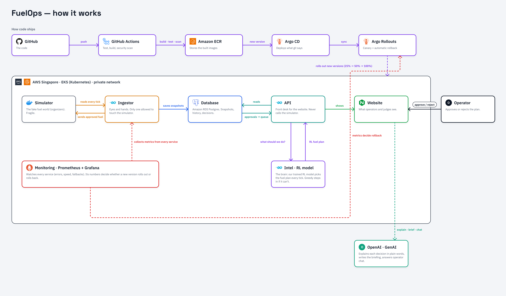

<div align="center">

# FuelOps

**Fuel Supply Intelligence & Resilience Platform**

An operator console over a fragile fuel-supply simulator. It reads the simulated
world, forecasts shortages, proposes and (optionally) auto-executes shipments, and
keeps serving through crises and faults.

`BUP_HACKATHON_DU_FANTA_2026`

Go 1.26 · Next.js 16 · Postgres 17 · Maskable PPO · AWS EKS

</div>

---

## Contents

- [Overview](#overview)
- [Architecture](#architecture)
- [Quick start](#quick-start)
- [Tech stack](#tech-stack)
- [Repository layout](#repository-layout)
- [API reference](#api-reference)
- [Backend contract](#backend-contract)
- [Development](#development)
- [Infrastructure](#infrastructure)
- [Documentation index](#documentation-index)

---

## Overview

The simulator is fragile: it wedges permanently at ~15 concurrent requests and
silently destroys fuel in several cases. So the design is simple.

> **One careful process talks to the simulator; everything the UI needs is served
> from Postgres.**

That process (the *ingestor*) snapshots the world, forecasts demand, asks the
*intel* planner what to ship, and drains an outbox back to the simulator. A
stateless *API* serves the operator UI from Postgres and never touches the
simulator.

---

## Architecture



| Component | Role |
|---|---|
| **Simulator** | The simulated fuel world (organizer image). Fragile: wedges at ~15 concurrent requests, destroys fuel in several cases. |
| **Ingestor** | The **only** process allowed to call the simulator (Postgres advisory-locked single writer, up to 4 requests in flight). Snapshots the world, mirrors demand, asks intel for a plan, drains the outbox. |
| **Intel** | Stateless planner: trained RL policy (Maskable PPO) plus greedy baseline, risk projection, anomaly detection, Jev auto/review triage. |
| **API** | Stateless, N replicas. Serves the UI over REST/SSE from Postgres. Never calls the simulator. |
| **Website** | Next.js operator UI. Operators approve/reject plans; GenAI (OpenAI) explains decisions and answers chat. |
| **Postgres** | Snapshots, demand history, recommendations, decisions, outbox. |
| **Delivery + observability** | GitHub Actions to ECR to Argo CD / Rollouts on EKS; Prometheus + Grafana metrics gate canary rollout and rollback. |

---

## Quick start

```bash
cp .env.example .env          # optional: TYPESAFE_API_KEY (Jev), OPENAI_API_KEY (chat)
docker compose up --build     # compose.yaml
```

| Service | URL |
|---|---|
| Operator UI | http://localhost:3000 |
| Operator API (Swagger `/docs`, ReDoc `/redoc`) | http://localhost:8000 |
| API status / state | `…/api/status` · `…/api/state` |
| Ingestor health | http://localhost:8081/healthz |
| Intel health | http://localhost:8082/healthz |
| Jaeger (traces) | http://localhost:16686 |
| OTel metrics | http://localhost:8889/metrics |

> The simulator has no host port. Only the ingestor reaches it in-network at
> `http://simulator:8000`. Tracing is on by default; unset
> `OTEL_EXPORTER_OTLP_ENDPOINT` in `.env` to disable it (Prometheus `/metrics` is
> unaffected).

---

## Tech stack

| Layer | Technology |
|---|---|
| **Backend** | Go 1.26. One image, four commands: `fuelops api \| ingestor \| intel \| migrate` |
| Backend libs | pgx v5 · goose (migrations) · prometheus/client_golang · OpenTelemetry (otelhttp, otelpgx) · openai-go |
| **RL policy** | Maskable PPO (`crevious/fuelops-maskable-ppo-20260929`, seed 11) exported to Go; greedy heuristic baseline |
| **Frontend** | Next.js 16 (standalone) · React 19 · TypeScript · TanStack Query · Tailwind v4 · shadcn · Vercel AI SDK |
| **Datastore** | Postgres 17 (RDS in prod) |
| **Simulator** | `asifmahmoud414/bup-fuel-supply-simulator` (amd64) |
| **Observability** | Prometheus + Grafana · OpenTelemetry to Collector to Jaeger |
| **Infra** | Terraform (AWS, EKS) · Helm · Argo CD + Rollouts · GitHub Actions · ECR |

---

## Repository layout

```
backend/    Go module. cmd/fuelops (api·ingestor·intel·migrate·replay), cmd/rlbridge
            internal/ (api, ingestor, intel, planner, policy, rl, sim, store, obs, llm, genai)
frontend/   Next.js + React + TS operator UI (port 3000; ALB routes /api to the API)
infra/      Terraform (AWS, EKS)
deploy/     Helm, Argo, OTel collector config
rl/         RL training / export artifacts
docs/       API.md, BRIEF.md, PLAN.md, RL_DESIGN.md, architecture.png, guides
```

---

## API reference

Served by `fuelops api` on `:8000`; the UI calls it under `/api`. Machine-readable
spec at `/openapi.yaml`, Swagger UI `/docs`, ReDoc `/redoc`.
**Full reference: [`docs/API.md`](docs/API.md).**

**Roles** (brief §18)

| Role | Auth | Can |
|---|---|---|
| `viewer` | none | all `GET` plus what-if `POST /api/simulate` |
| `operator` | `Bearer $OPERATOR_TOKEN` | + approve/reject, manual & cancel allocation, ack alert |
| `admin` | `Bearer $ADMIN_TOKEN` | + simulator control, crisis/fault injection, policy, command log |

> No token set: auth off, every caller is admin (local dev only).

**Key endpoints**

| Group | Endpoints |
|---|---|
| Read | `GET /api/overview` · `/api/status` · `/api/network` · `/api/risk` · `/api/demand` · `/api/alerts` |
| Decide | `GET /api/recommendations` · `POST /api/recommendations/{id}/approve\|reject` · `POST /api/simulate` (what-if) |
| Act | `/api/allocations` · `/api/decisions` · `GET /api/rl` |
| Live | `GET /api/stream` (SSE) |
| Admin | `/api/admin/sim/*`: step / run / pause / reset, events, faults |

---

## Backend contract

- Each process exposes `/healthz` (readiness), `/version`, `/metrics`. Default
  ports: api `:8080`, ingestor `:8081`, intel `:8082`. Compose / K8s set the API's
  `HTTP_ADDR` to `:8000`.
- **Config:** `HTTP_ADDR` · `DATABASE_URL` · `SIM_BASE_URL` · `SIM_MAX_INFLIGHT`
  (default 4) · `INTEL_URL` · `TYPESAFE_API_KEY` · `OTEL_EXPORTER_OTLP_ENDPOINT`
  (unset = tracing off).
- **Rollback-demo chaos flags** (api, intel): `CHAOS_500_PCT=0..100` ·
  `FAIL_HEALTH=true`.
- **Only the ingestor talks to the simulator**, up to 4 requests in flight. See
  [`docs/PLAN.md`](docs/PLAN.md) §2.

---

## Development

```bash
# backend
cd backend && CGO_ENABLED=0 go test -race ./... && go vet ./...

# frontend
cd frontend && pnpm test && pnpm typecheck
```

---

## Infrastructure

See [`infra/README.md`](infra/README.md) for pinned dependencies, bootstrap
ordering, [private operator access](infra/README.md#private-operator-access),
GitHub OIDC, existing-environment adoption, and validation commands.

Deployment publishes FuelOps, authenticated Grafana at
`https://fuelops.hemal.me/grafana/`, and authenticated Argo CD over HTTPS
([TLS setup](docs/HTTPS_SETUP.md)). Follow
[operator access & API-auth adoption](docs/OPERATOR_ACCESS_AUTH.md) for rollout
order; remaining fixes are tracked in
[`docs/INFRA_WORK_PLAN.md`](docs/INFRA_WORK_PLAN.md).

---

## Documentation index

| Doc | What |
|---|---|
| [`docs/API.md`](docs/API.md) | **Operator API**: every endpoint, request/response, flows, errors, SSE, alerts, metrics |
| [`docs/BRIEF.md`](docs/BRIEF.md) | Product brief |
| [`docs/PLAN.md`](docs/PLAN.md) | Execution plan (§2: the simulator's failure modes) |
| [`docs/RL_DESIGN.md`](docs/RL_DESIGN.md) | RL policy design, training, verification |
| [`docs/SIMULATOR_GUIDE.pdf`](docs/SIMULATOR_GUIDE.pdf) | Simulator integration guide |
| [`docs/INFRA_DECISIONS.md`](docs/INFRA_DECISIONS.md) · [`INFRA_WORK_PLAN.md`](docs/INFRA_WORK_PLAN.md) | Infrastructure decisions and remaining work |
| [`docs/HTTPS_SETUP.md`](docs/HTTPS_SETUP.md) · [`OPERATOR_ACCESS_AUTH.md`](docs/OPERATOR_ACCESS_AUTH.md) | ACM/Cloudflare TLS; operator access & API-auth rollout |
| [`infra/README.md`](infra/README.md) | Bootstrap ordering, OIDC, private operator access, validation |
